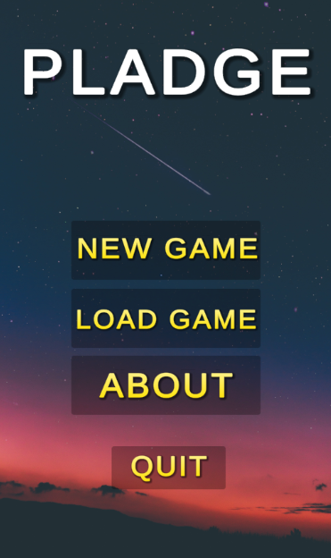
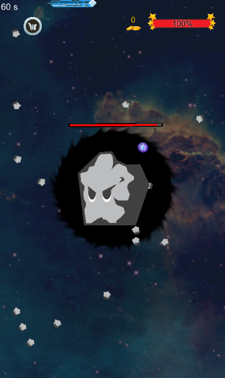

# Pladge

Pladge is a simple game for mobile phones in which the player moves a platform around the edge of the phone screen. The player can change the direction of the platform to dodge projectiles fired by monsters, as well as collect coins or perks.

## To do

In the future we're going to program more levels (currently we can fight only one monster, in two stages), additionally we're going to extend the perks system and the built-in shop, where the player will be able to buy life, additional skills etc. for collected coins.

## Screenshots

